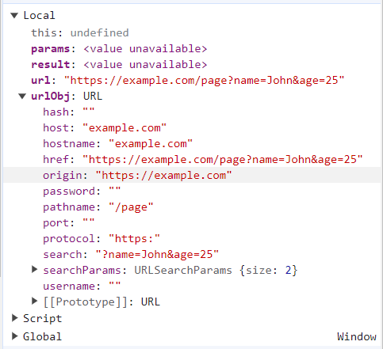

## Retrieve query params from a URL string:

**Approach Taken**:

1. whatever the url you are getting as a argument, pass that inside new URL(passed_argument)
2. once you log the above stored variable you would see different fields in the object. (ex: below image)



3. take the `search` field using `.search` notation and pass that inside URLSearchParams and store this in a another variable called params or anything
4. do a `for of` loop on the `params.entries()` and we need key, value from the params.entries()
5. store them inside a result obj

```js
const getQueryParams = (url) => {
  const urlObj = new URL(url);
  const params = new URLSearchParams(urlObj.search);
  const result = {};

  for (const [key, value] of params.entries()) {
    result[key] = value;
  }
  return result;
};

const queryParams = getQueryParams('https://example.com/page?name=John&age=25');
console.log(queryParams); //{name: 'John', age: '25'}
```
