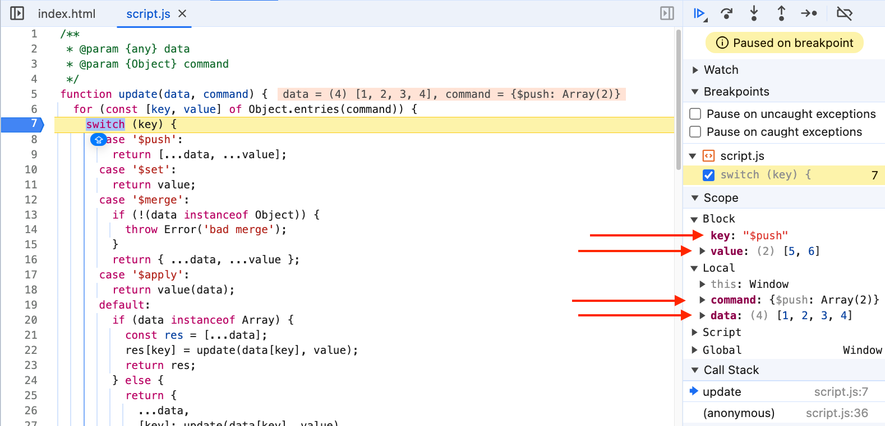

## Immutability Helper

**Approach Taken:**
1. If the command is **$push**, we want to add more items to an array (Return a new array with the old data plus the new items)
2. If the command is **$set**, we want to replace the old data with new data (Return the new data)
3. If the command is **$merge**, we want to merge two objects together (Check if the old data is really an object)
4. If the command is **$apply**, we want to apply a function to the data (Return the result of the function when applied to the old data)

```js
/**
 * @param {any} data
 * @param {Object} command
 */
function update(data, command) {
  for (const [key, value] of Object.entries(command)) {
    switch (key) {
      case '$push':
        return [...data, ...value];
      case '$set':
        return value;
      case '$merge':
        if (!(data instanceof Object)) {
          throw Error('bad merge');
        }
        return { ...data, ...value };
      case '$apply':
        return value(data);
      default: // If the command is not one of the above, it might be nested commands
        if (data instanceof Array) {
          // Check if the old data is an array
          // Create a new array
          const res = [...data];
          // Recursively call update for nested updates
          res[key] = update(data[key], value);
          // Return the new array
          return res;
        } else {
          // If the old data is an object
          // Create a new object
          return {
            ...data,
            // Recursively call update for nested updates
            [key]: update(data[key], value),
          };
        }
    }
  }
}

// Example 1: Using $push to add elements to an array
const arr = [1, 2, 3, 4];
const newArr = update(arr, { $push: [5, 6] });
console.log('USING PUSH', newArr); // Output: [1, 2, 3, 4, 5, 6]

// Example 2: Using $set to replace the data
const state = {
  a: {
    b: {
      c: 1,
    },
  },
  d: 2,
};

const newState = update(state, { a: { b: { c: { $set: 3 } } } });
console.log('USING SET', newState); // Output: {a: {b: {c: 3}},d: 2}

// Example 3: Using $merge to merge objects
const state1 = {
  a: {
    b: {
      c: 1,
    },
  },
  d: 2,
};

const newState1 = update(state, { a: { b: { $merge: { e: 5 } } } });
console.log('USING MERGE', newState1); // Output: {a: {b: {c: 1, e:5 }}, d: 2}

// Example 4: Using $apply to apply a function to the data
const arr1 = [1, 2, 3, 4];
const newArr1 = update(arr, { 0: { $apply: (item) => item * 2 } });
console.log('USING APPLY', newArr1); // Output: [2, 2, 3, 4]
```

---

## HOW EXACTLY THE CODE LOOKS BEHIND THE SCENES
