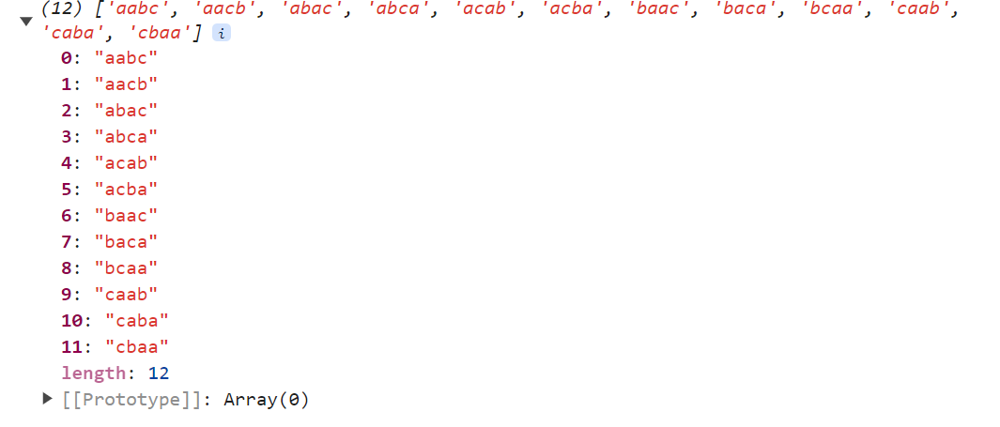

```js
function findPermutations(inputStr) {
  //below condition for inputStr is called in recursion
  if (inputStr.length < 2) {
    return inputStr;
  }

  // Output in array format
  let permutationArray = [];

  // for loop based on string.length
  for (let i = 0; i < inputStr.length; i++) {
    // get each and every char
    let char = inputStr[i];

    // your inputString should not produce duplicates (use indexOf)
    if (inputStr.indexOf(char) !== i) continue;

    // get the remainingChars using slice by removing the current character
    let remainingChars = inputStr.slice(0, i) + inputStr.slice(i + 1);

    //recursion
    for (let permutation of findPermutations(remainingChars)) {
      permutationArray.push(char + permutation);
    }
  }
  //return array outside to 1st for loop
  return permutationArray;
}

console.log(findPermutations('aabc'));
```

