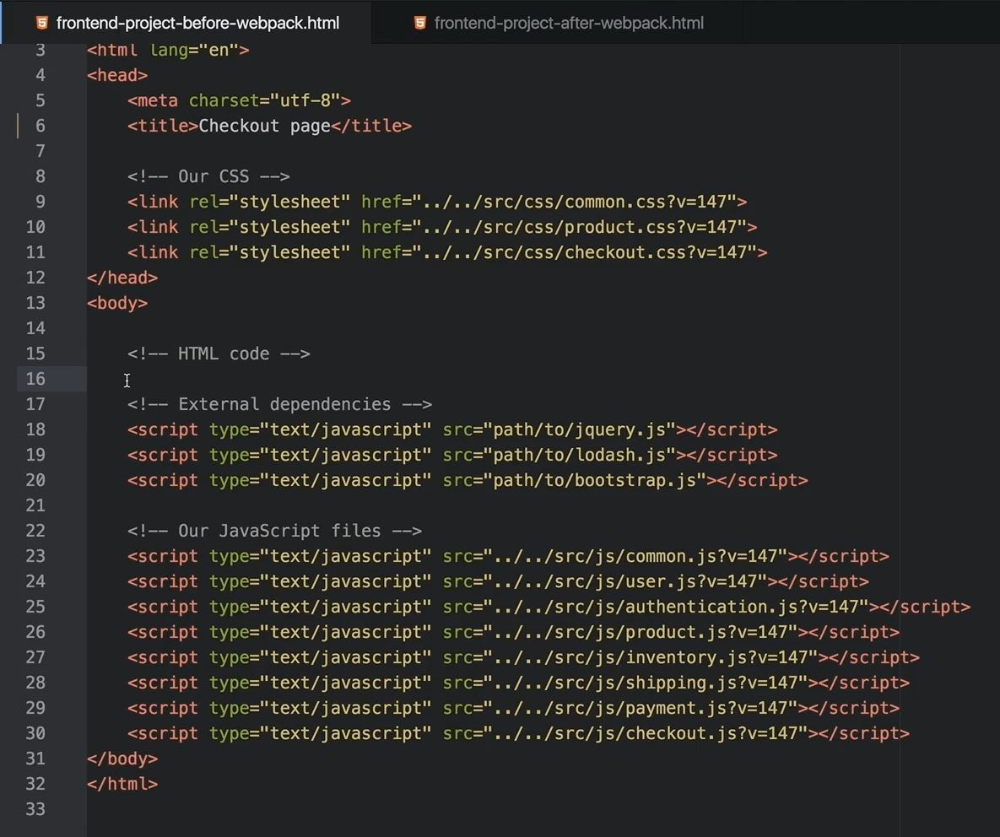
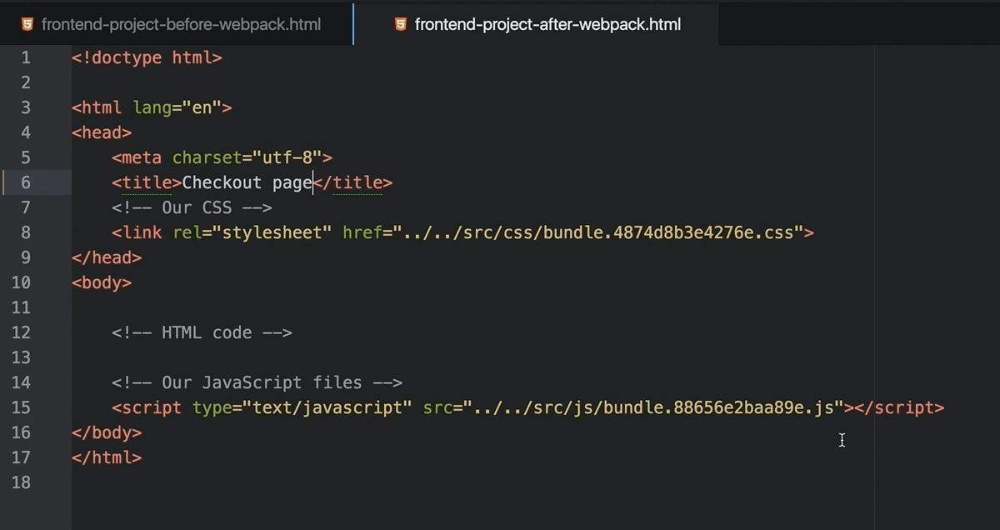

### Back in those days web applications used to look like this:

- Here we can see that **several files** are included, but the biggest problem over here is:

- If you accidentally **change the order of the `Javascript` files**, this **project might `break`**.

### In order to get rid of above:

- People started to use **`Grunt`** and **`Gulp`**
- These tools helped us to **manage assets** and **concatenate all our Javascript files into one**.
- But they **still <ins>cannot figure out dependencies</ins> between those files**

### In order to manage Javascript dependencies
- We used **`Require.js`**
- but it's not as powerful as **`Webpack`**.

-----

### Webpack is a static module bundler for modern Javascript applications

- When Webpack processes your application, 
  - it recursively **`builds`** a **dependency graph** 
  - that **`includes`** every module in your application 
  - and then **`packages`** all of those modules into one or more bundles.

-----

### When people started using Webpack, most of the apps started to look like below:

- There are only two files here:
  - One file for **`CSS`**
  - One file for **`Javascript`**

- There are no hidden dependencies.
- We <ins>**don't have to worry about the correct order of the files</ins>** anymore.
- All dependencies, internal and external are bundled inside this file

-----

### Webpack is a single tool for managing all your `code` as well as `assets` in 1 place

-----