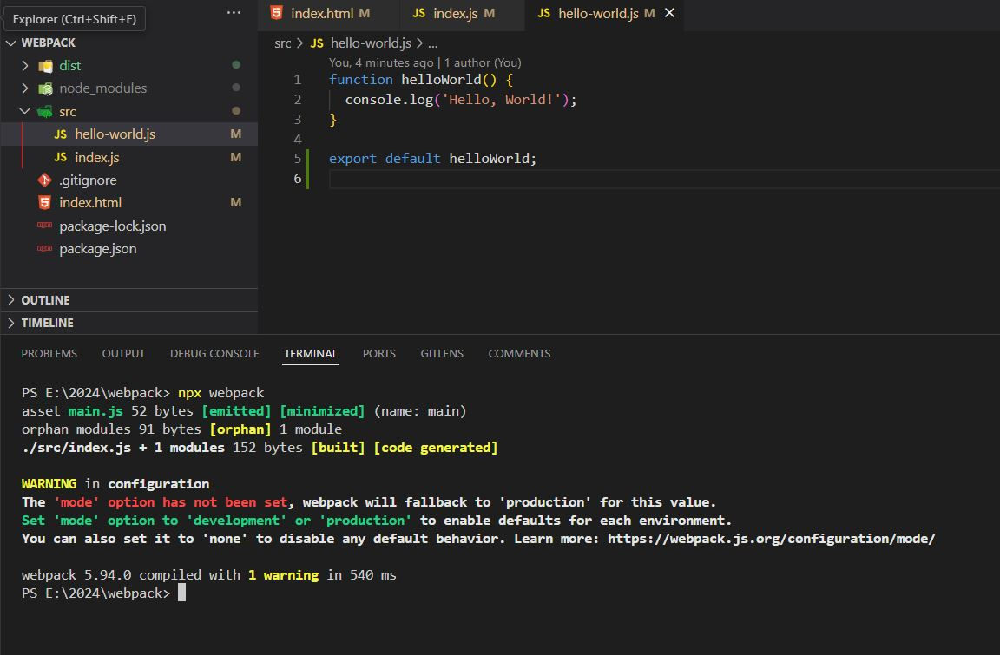
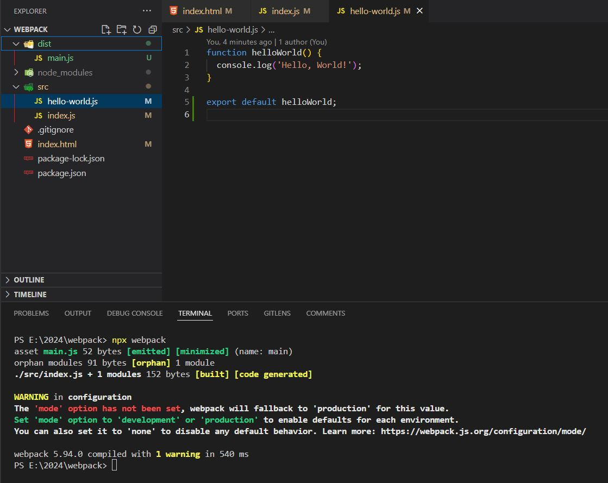
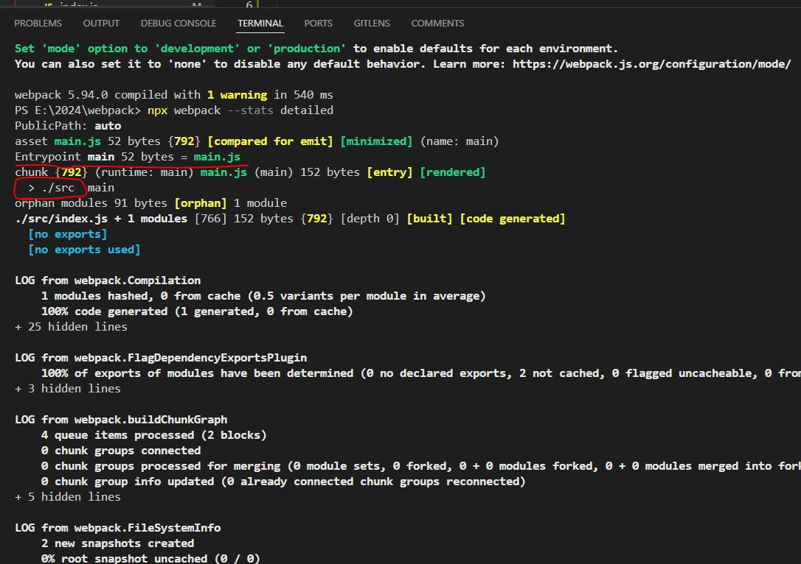

### Integrating Webpack into our JS Application

1. First of all, let's go to the **`HTML`** file and **remove one of the scripts** (i.e; hello-world.js)

```html
<!-- index.html-->
  <body>
    <!-- <script src="./src/hello-world.js"></script> -->
    <script src="./src/index.js"></script>
  </body>
```

2. Go to the **`index.js`** file and import the helloWorld function


```js
// index.js
import helloWorld from './hello-world.js';

helloWorld();
```


3. Go to the **`hello-world.js`** file and write the export logic

```js
function helloWorld() {
  console.log('Hello, World!');
}

export default helloWorld;
```


----

### Syntax that we are using here (import/export) is related to ECMAScript modules

- Webpack supports ECMAScript modules by default


---

### Now let's go to the terminal and run Webpack

```js
npx webpack
```



----

### Normally we would provide a configuration file for Webpack
- However, Webpack 5 uses the default configuration unless you provide a custom
- You can also notice that **Webpack complains that the mode option hasn't been set**.
- Mode is a special option for Webpack that makes it much easier to set up different configurations for **`production`** and **`development`** use cases.

---

### You can see that one file was generated under dist folder




- If you provide a custom configuration to Webpack, you will be able to choose the name of the output file.
- As of now our main.js is nothing but it has optimized version of our code.

----

### If you are curious to know how Webpack figured out where to take this code from (I mean main.js code)

```js
npx webpack --stats detailed
```



- Entry point is a file which Webpack uses as a **starting point** when building your application.
- This file would usually <ins>**import other modules from the application**</ins>.
- Here, Webpack assumes that the <ins>**entry point is located inside the folder named**</ins> **`src`**

### Again, this is the default entry point and you can easily change it when you provide your own configuration file to Webpack.

----

### Please refer

https://github.com/saiteja-gatadi1996/webpack-basics-to-advanced/commit/2b7205a83f62f6dd47aa50e7d463438d1c3d758a