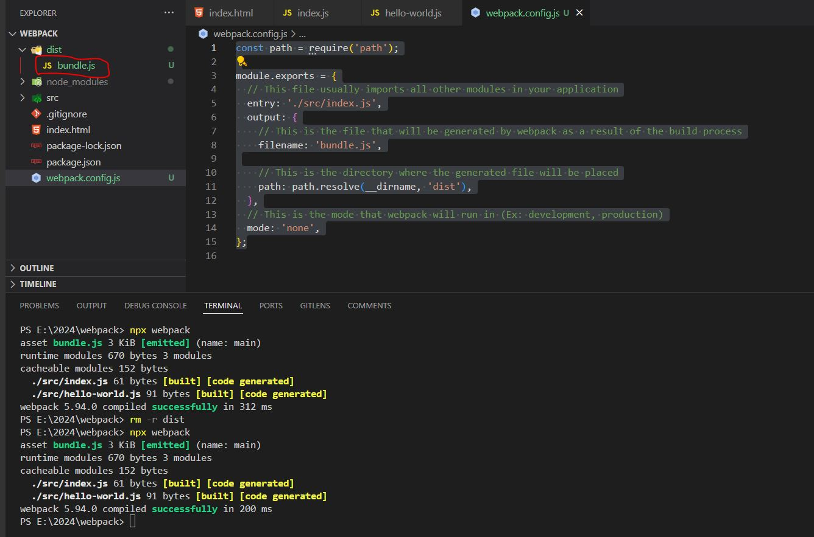
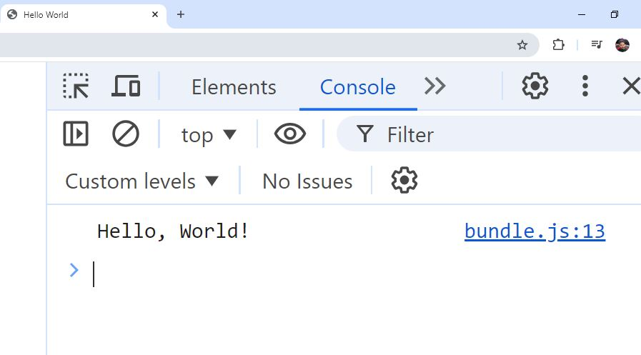

## Custom Webpack Configuration

### Webpack stores its configuration in a Javascript file, typically named `webpack.config.js`

- We need to create this file in the **`root` folder** (I mean where your package.json resides)


```js
//webpack.config.js
const path = require('path');

module.exports = {
  // This file usually imports all other modules in your application
  entry: './src/index.js',
  output: {
    // This is the file that will be generated by webpack as a result of the build process
    filename: 'bundle.js',

    // This is the directory where the generated file will be placed
    path: path.resolve(__dirname, 'dist'),
  },
  // This is the mode that webpack will run in (Ex: development, production)
  mode: 'none',
};
```

```js
// remove the existing dist folder by following command
rm -r dist

// run command
npx webpack
```




----

### As you can see, the name of the bundle file differs from the default 
- This is due to the reason that we started to use custom configuration for Webpack

---

### Change the path in index.html 

```html
<!-- index.html -->

<body>
    <script src="./dist/bundle.js"></script>
  </body>
```

---

### Now let's go to the browser and check



- Now we are using the code generated by Webpack.


----

### Creating a script in package.json

```json
"scripts": {
    "build": "webpack"
  },
```

---

### Please refer 

https://github.com/saiteja-gatadi1996/webpack-basics-to-advanced/commit/a2f8ec6768de6eb29ca2c18429d8749f925779f4