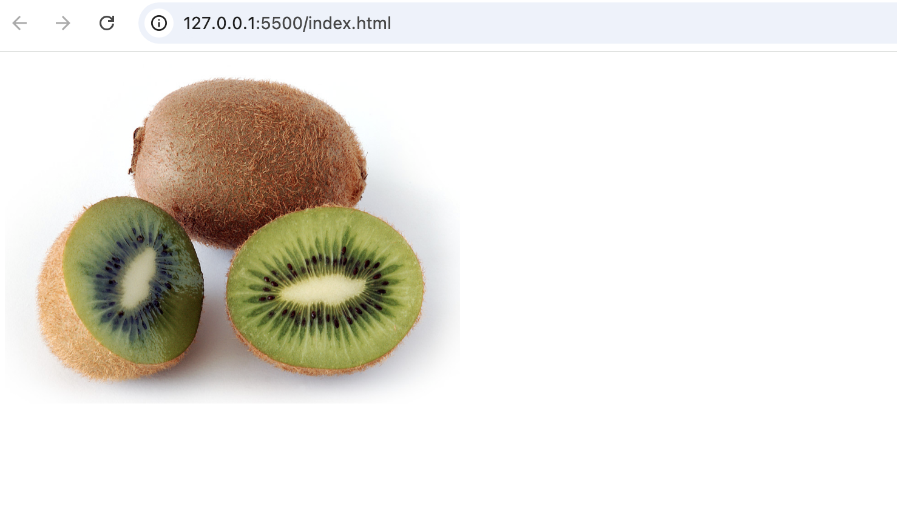

### Handling Images

1. I have added a **Kiwi.jpg** image in src folder
2. I have created a file called **add-image.js**
3. I have create a **function addImage()**

```js
//add-image.js
import Kiwi from './Kiwi.jpg';

function addImage() {
  const img = document.createElement('img');
  img.alt = 'Kiwi';
  img.width = 300;
  img.src = Kiwi;
  const body = document.querySelector('body');
  body.appendChild(img);
}

export default addImage;
```

4. Let's go to the **index.js** file

```js
//index.js

import helloWorld from './hello-world.js';
import addImage from './add-image.js';

helloWorld();
addImage();
```

5. Now we need to add a special rule in the webpack in order to tell how to import image files inside the Webpack Configuration file.

```js
// webpack.config.js

module.exports = {
  // added module
  module: {
    rules: [
      {
        // This is a regular expression that matches all png or jpg files
        test: /\.(png|jpg)$/,
        type: 'asset/resource',
      },
    ],
  },
};
```

6. Run the following command **npm run build**
7. You will see the Kiwi image on your server.

---




----