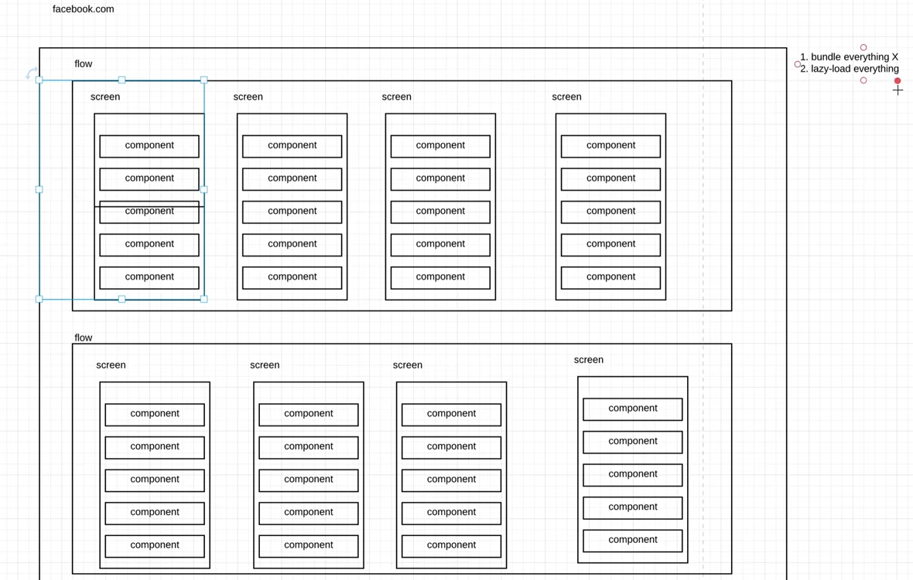
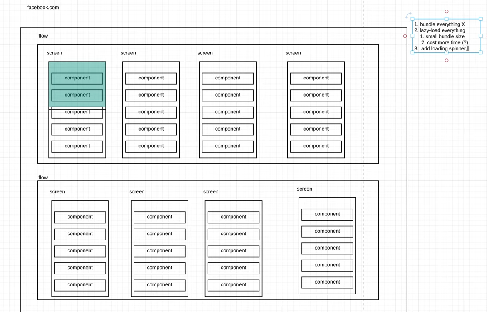
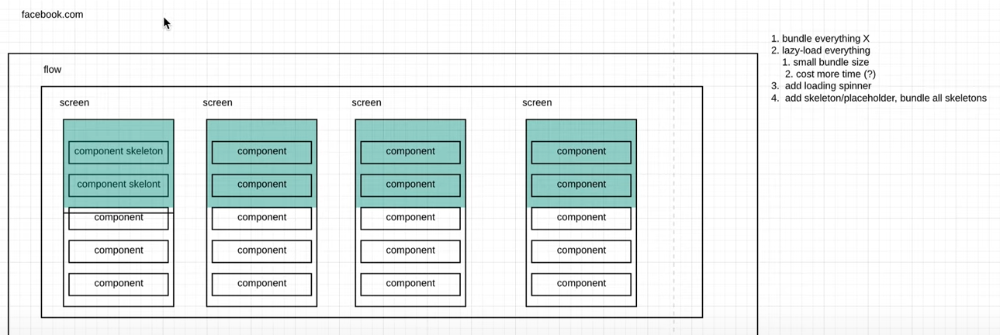

# Frontend System Design Problem: Designing a Facebook Web App

**Source:** [YouTube Video](https://youtu.be/lZhvia5q8Zk?si=DZcB_w3cquXts_Li) 

---

## Introduction

- **Question:** What if I were asked to design a new Facebook web app?
- **Plan:** Apply system design steps in 30–40 minutes.

---

## 1. Understanding the Problem

- **Goal:** Understand what Facebook.com is.
- **Features:**
  - Tabs with different web services like **Discovery**, **Gaming**, **Chat**, **Friends**, **Timeline**, etc.
  - Huge app with many **screens** and **components**.
- This isn't about product design; it’s about **organizing code**, improving **structure**, and optimizing performance.

---

## 2. Defining Goals

- **Primary Goals for Improvement:**
  1. Make it **fast**.
  2. Make it **smooth**.
- Improvements are for **front-end best practices**.

---

## 3. Core Problem

- Facebook.com is a **huge complex web app**.

  - Naive structure (bundling everything) leads to **bloat**.
  - Results in slow **initial load** and wasted resources.

- **Example Issue:**
  - Initial screen may load 8MB.
  - Switching to new features increases load further.

---

## 4. Analyzing the Problem

### Structure of a Web Application

- **Hierarchy:**

  - **Flows**: Groups of screens.
  - **Screens**: Contain components.
  - **Components**: Smaller building blocks.

- **Above-the-Fold Concept:**
  - Focus on components visible on the screen immediately.

---

## Solution Approaches

### i) Bundle Everything

- **Problems:**
  - Large bundle size.
  - Slow loading of initial screens.

---

### ii) Lazy Load Everything

- **Advantages:**

  - Smaller bundle size.
  - Loads only necessary resources **(`Green` Color)**

- **Disadvantages:**

  - More round trips increase load time.
  - Users see a lot of **white screens**.

- **Improvement Options:**
  1. **Loading Spinner:** Simple but boring.
  2. **Skeletons (Placeholders):** Pre-load layout geometry to give users context.

---

### iii) Skeleton Approach

- **Concept:**

  - Create skeleton versions of flows, screens, and components.

- **Advantages:**

  - Feels **instant** to users.
  - Efficiently **prepares layout**.

- **Problems:**

  - Complexity increases with the number of flows and screens.

- **Optimized Skeleton Strategy:**
  - Use skeletons only for **important components and screens** (e.g., Home tab, Timeline).

---

### iv) Prefetching

- **Use Prefetch Hints:**
  - Analyze user behavior to predict the next probable screen.
  - Prefetch resources for instant transitions.

---

## 5. Skeleton Implementation

### i) Separate Skeleton Components

- Create separate versions of components:
  - **Skeleton Version:** Without dynamic import.
  - **Full Version:** With dynamic import.

---

### ii) Unified Component Approach

- Use **dummy data** and classes to handle missing content:
  - Gray areas for placeholders.
  - Original components handle both skeleton and full data states.

---

## 6. Making It Smooth

### i) Instant Go Forward

- Use skeletons to provide **instant feedback**:
  - Primitive versions of components render immediately.

---

### ii) Instant Go Back

- **Challenges:**

  - Restoring scroll positions, carousel states, etc.

- **Improvements:**

  1. Cache data using **Redux** or **API caching**.
  2. Use a **Page Stack**:
     - Keep previous screens in memory.
     - Avoid reconstructing DOM.

- **Advantages of Page Stack:**

  - Keeps **UI state** intact.
  - Offers **instant feedback**.

- **Potential Issue:**
  - DOM can bloat if the stack grows too deep.

---

## iii) Native OS and UI Restoration

- **Native OS Behavior:**
  - The native OS can destroy the UI when the screen is turned off or the activity ends.
  - Upon returning, the **UI is restored using the stored memory**.
- **Implications for Web Apps:**
  - Web developers must manually handle events for saving and restoring data.
  - Example: For a weather app, we could implement similar functionality to ensure a smooth user experience.

---

### iv) Sliding Window and Page Stack Approach

- **Concept:**

  - Use a **sliding window** mechanism with a **page stack** to manage navigation.
  - Instead of removing screens (DOM nodes), <ins>**_retain data in memory for faster restoration_**</ins>.

- **Process Overview:**

  1. Destroy inactive screens but retain their memory.
  2. Utilize a stack to manage the UI state dynamically.
  3. When returning to a previous screen, restore it instantly from memory.

- **Benefits:**

  - Instant navigation and jank-free animations.
  - Centralized control for history changes:
    - Example: Discard confirmation dialogs can be implemented at the page stack level rather than on each screen.

- **Challenges:**
  - History management requires interception.
  - UI state preservation might demand additional resources.

---

### v) Animations and Native-Like Components

- **Animations:**

  - Must be **jank-free** for smooth user experience.
  - On lower-spec devices, animations may degrade. Solutions include:
    - Use progressive enhancements like **Lottie**.
    - Remove or simplify animations on unsupported devices.

- **Native-Like Components:**
  - Essential for familiarity and smooth user interaction.
  - Examples:
    - Gesture-based interactions (e.g., swipe gestures).
    - Components like **toasts**, **action sheets**, etc.

---

## 7. Lazy Load + Page Stack Approach

- **Core Solution:**

  - **Lazy Load Policy**:
    - Load resources only when necessary.
  - **Page Stack Mechanism**:
    - Retain the DOM but optimize its memory usage.

- **Best Practices:**

  - Compress static resources.
  - Use a CDN for resource delivery.
  - Pre-fetch initial data and implement effective caching strategies.

- **Cross-Team and Micro-Frontend Considerations:**

  - For large projects:
    - Multiple teams may work on different features.
    - Require independent deployment capabilities.
  - Solution:
    - Implement **micro-frontends**.
    - Avoid sharing components between teams to reduce maintenance overhead.

- **Trade-Offs:**
  - Maintaining shared components across teams is resource-intensive.
  - Teams might adopt a "fork and copy" approach for autonomy.

---

## 8. Design System and Consistency

- **Challenges:**

  - Multiple teams might lead to inconsistent design.
  - Designers often focus on specific screens, causing style discrepancies.

- **Solution:**
  - Shift focus from screen-specific designs to **component-based design systems**.
  - Establish guidelines for layouts, components, and overall aesthetics.

---

## 9. Summary and Workflow

1. **Define Background and Goals:**
   - Goal: Achieve a **speedy** and **smooth** web application.
2. **Identify Core Problems:**
   - Navigation performance, animation smoothness, and team collaboration challenges.
3. **Propose Solutions:**
   - Lazy Load + Page Stack for performance.
   - Micro-frontends for team independence.
   - Component-based design systems for consistency.
4. **Evaluate Trade-Offs:**
   - Maintenance complexity vs. team autonomy.
5. **Future To-Do's:**
   - Enhance the lazy load and page stack strategies.
   - Establish better cross-team communication processes.

---

## 10. Reflection and Tools

- **Reflection:**

  - The explanation could be smoother and more concise.
  - Tools like Lucidchart aid in visualizing and organizing ideas.

- **Steps Recap:**

  1. Define the problem.
  2. Propose solutions.
  3. Highlight trade-offs.
  4. Plan future steps.

- **Closing Notes:**
  - Encourage the use of diagrams for clarity.
  - Practice structured and concise communication.

---
