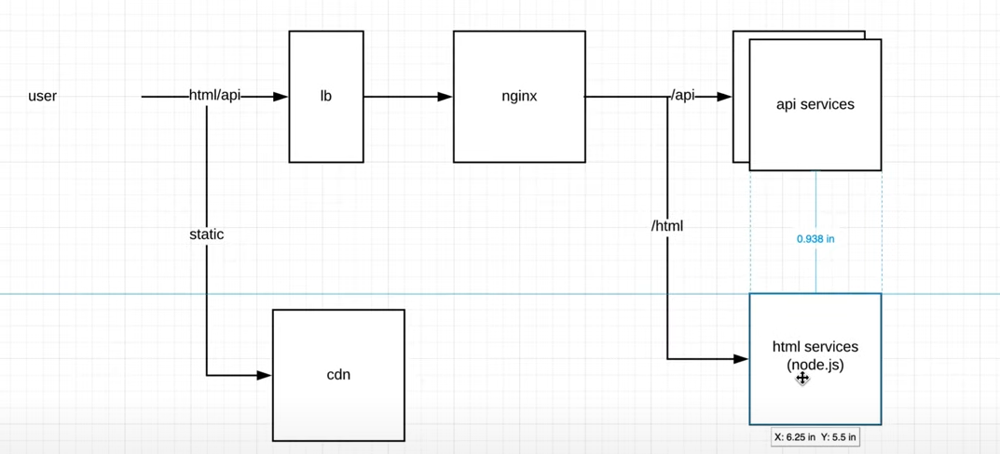
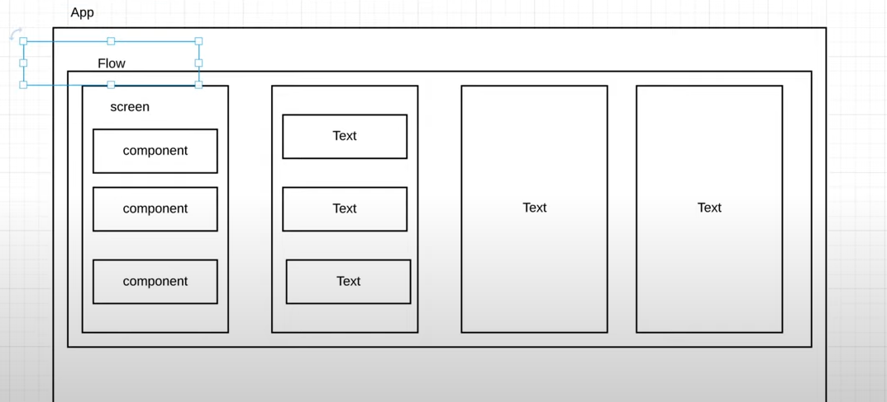

# Front-End System Design - Design an Instagram

**Source:** [YouTube Video](https://youtu.be/LCnkSLRJRwM?si=SduCnE3_M65SxYl8) 

----

## Background

> **Instagram** is a platform where **_users can upload and share photos or videos_**.
>
> - Relationships between users can be **followers** or **friends**.

The primary goals for a web version are:

- **Lightweight Front-End**: Persuade users to download the native app while offering basic functionality.
- **SEO Optimization**: Focus only on the **profile page** for crawlability, leveraging an SPA (Single Page Application) for better transitions and design control.
- **Mobile-First Design**: Prioritize mobile users with partial desktop adaptation (e.g., uploads via mobile only).
- **Potential PWA Integration**: Consider Progressive Web App features if time permits.

---

## 1. Functional Requirements (Minimal Viable Product-MVP)

1. **Timeline**: Display of posts.
2. **Post Detail Page**: In-depth view of individual posts.

### Goals

- **Speed**: Ensure **fast loading** and **smooth transitions**.
- **High-Quality Photo Handling**: Special focus on image processing for performance.

---

## 2. General Data Flow

1. **User Request**
   - Goes to the **load balancer**.
   - Routed to services (e.g., API or HTML service).
2. **Static Resources**
   - Delivered via **CDN** (Content Delivery Network).
3. **API Services**
   - Divided into backend API services and Node.js services for front-end engineers to manage.

**_Simplified Flow:_**

- HTML & API services handle requests.
- Static resources like images are managed via CDN.

---

## 3. Front-End Component Structure

The components are categorized into:

1. **App Entry**: Initializing logic and entry points.
2. **Flows**: Groups of screens (e.g., settings, post creation).
3. **Screens**: Collections of UI components.
4. **Common Components**: Shared elements like layouts or dialogs.

### API Requirements

- **Timeline API**: Fetch post timelines.
- **Post Detail API**: Retrieve specific post details.

---

## 4. Key Challenges

### 1. Speed Optimization

#### Lazy Loading Strategy:

- **Flow Layer**: Load flows based on navigation paths.
- **Screen Layer**: Load individual screens dynamically.
- **Component Layer**: Lazy-load components for parts of a screen (e.g., above-the-fold content).

#### Balancing Bundles:

- **Heavily Used Features**: Bundle and prefetch frequently accessed flows/screens (e.g., timelines).
- **Rarely Used Features**: Fully lazy-load (e.g., settings).

---

### 2. Smooth Transitions

#### Instant Navigation:

- **Skeleton Screens**: Display placeholder shapes for content until data arrives.
- **Data Prefetching**: Use existing data (e.g., from a timeline) to prepopulate details.

#### Instant Go Back:

- Implement a **Page Stack** approach:
  - Retain DOM structure for previous pages.
  - Enable lifecycle methods for smoother re-entry of screens.
  - Add animations for enhanced user experience.

#### Sliding Window for Memory Efficiency:

- Keep a maximum of **3 screens** in memory.
- Remove unused screens dynamically while maintaining state restoration.

---

### Smoothness Considerations

- **Speed vs. Perception**: Speed ensures fast rendering, while smoothness focuses on how interactions feel to users.
- **Common Techniques**:
  - Prefetch resources.
  - Use compressed data and optimized bundles.

---

## Improving Navigation and Interaction

### **Instant Back Navigation**

- The current navigation flow needs improvements for **instant back** functionality.
- Suggested solution: Optimize caching and preloading mechanisms to enable a smooth and seamless return to the previous view.

---

## Enhancing Image Handling

### **Making Images Beautiful and Smooth**

1. **Compression**:
   - Use advanced compression techniques (e.g., Gzip, Brotli) to minimize image sizes.
   - Serve optimized images through a CDN.
2. **Responsive Images**:

   - Leverage the `srcset` attribute for responsive image rendering across different devices.

3. **Lazy Loading**:

   - Enable native browser support for lazy loading (e.g., Chrome’s native lazy load feature).
   - Avoid flickering by displaying placeholders, such as:
     - Skeleton loaders.
     - Progressive blur placeholders.

4. **Blurry Progressive Approaches**:
   - Implement progressive JPEGs or rasterized placeholders.
   - Transition from blurry dummies to fully loaded images to create a smoother user experience.

---

## Optimizing Timeline Rendering

### **Challenges with Long Timelines**

1. **Infinite Scroll**:

   - Use infinite scroll with a viewport buffer (e.g., 2x the viewport height) to dynamically load content.
   - Remove off-screen components to reduce memory usage.

2. **Pagination Hybrid**:

   - Combine infinite scroll for the first 100 posts with manual pagination to balance performance.

3. **User-Friendly Updates**:
   - Provide features like:
     - **Pull-to-refresh**.
     - **Service workers** to push notifications for new updates.
     - **Reload buttons** for quick timeline updates.

---

## Data Consistency and Viewport Updates

### **Dynamic Updates for Viewport-Specific Data**

- Update post metadata (e.g., likes, comments) dynamically within the user’s viewport.
- Implement Waypoint-based updates to limit data refreshes to visible content only.

---

## Accessibility and Future Improvements

### **Accessibility (A11Y)**

- Improve usability for users with different needs (e.g., screen readers, high contrast modes).
- Focus on responsive design and adaptable UI for a diverse user base.

### **Internationalization**

- Support multiple languages using a label-managed system:
  - Key-value pairs for translations handled by external services.
  - Download specific versions as needed.

---

## Design System and Development Challenges

### **Unified Design System**

- Encourage collaboration between designers and engineers to create:
  - Reusable components.
  - Uniform guidelines for consistent UI across devices.

### **Multi-Team Development**

- Address challenges in large projects (~150K+ lines of TypeScript):
  - Establish clear coding standards.
  - Adopt a micro-frontend approach to modularize development.

---

## Encouraging App Usage

### **Light Version for Web**

- Serve a limited data version for web users.
- Gently prompt users to download the app for enhanced functionality.

---

## Closing Notes

1. The presented solutions address major Instagram challenges but are not exhaustive.
2. Additional considerations:
   - **Accessibility** improvements.
   - **Design systems** to streamline UI.
   - **Multi-team collaboration** for better efficiency.

