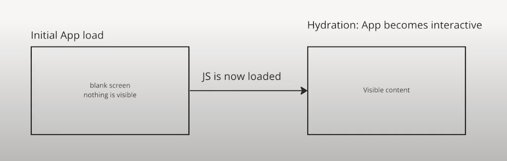
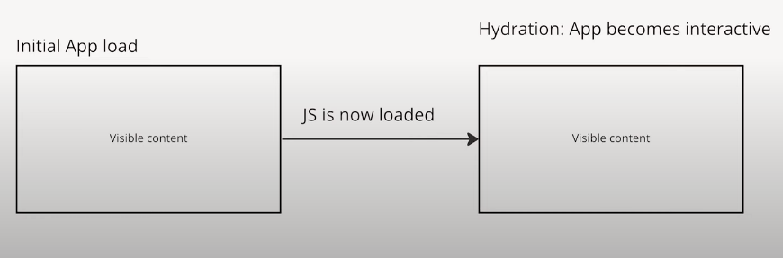

### No Pre-rendering

- A simple react application has no pre-rendering

1. The server sends a HTML file to the browser.
2. Browser receives a HTML file with

```js
<div id='root'></div>
```

3. After the client is hydrated with JS, our React code runs and then if fills that empty space with components.



---

### With Pre-rendering
- A NextJs Application

1. The server sends a HTML file to the browser
2. Browser receives a complete HTML file to display on screen
3. After the client is hydrated with JS, our app becomes interactive


