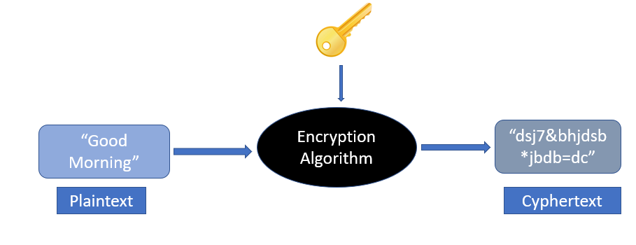

## Encryption:

- A hacker might be listening to our data while it is being transferred over the network. 
- This is troublesome if we are sending sensitive data like passwords.

```js
One of the best ways to protect the data transferred over the Internet is encryption.
```

- Encryption is a way of **converting** **`plaintext`** into **`ciphertext`** (an encoded text that is <ins>**not understandable**</ins> by the third party). 
- Encryption requires the use of an **encryption `key`** and an **encryption `algorithm`**.

```js
Both the `receiver` and the `sender` must have the encryption key.
```



---

## Types of encryption

### 1. Symmetric Encryption
- **Same key is used** for both **`encryption`** and **`decryption`**
- Example is sending messages between two persons (Ex: Saiteja and Pavan).
- Symmetric encryption **is much faster** than asymmetric encryption 
- and is **used to encrypt a large amount of data**.

#### Disadvantages: 
- (sender and receiver) **must share the same encryption key** to **`encrypt`** and **`decrypt`** messages. 
- The process of securely exchanging this key poses a risk, as **intercepting the key would allow** an attacker to **`decrypt`** the communication.

```js
The keys used in symmetric encryption are not very large, as the max length is 256 bits.
```
-  larger keys would offer more security but at the cost of slower encryption and decryption processes

---

### 2. Asymmetric Encryption
- the **`sender`** and **`receiver`** <ins>**use a separate key**</ins> to encrypt and decrypt the message. 
- This is also known as <ins>**PKI (Public Key Infrastructure)**</ins>. 

```js
- The advantage of this encryption is that the `keys are not transferred over the network`.
```
- So, it is <ins>**much safer than**</ins> symmetric encryption. 
- This encryption is achieved through a **public-private key model**.
- In this model, **two keys are used**: 
  - a public key, which is shared openly to encrypt messages, 
  - and a private key, which is kept secret by the receiver to decrypt messages. 
- This ensures that even if the public key is known, 
- only the **holder of the private key can decrypt the encrypted messages** enhancing security. 

```js
- The recipient sends a public key to all the senders. 
- The senders then encrypt the messages using this public key. 
- When the receiver receives the message, it uses its private key to decrypt the message. 
- The keys used in asymmetric encryption are fairly large and can be around 2048 bits.
```

<ins>**Note:**</ins>
- Since **`asymmetric`** encryption <ins>**is very slow**</ins>, it is normally <ins>**used once to exchange the encryption key safely**</ins>. 
- After that, all the communication is done using symmetric encryption.

----

## What is an encryption algorithm?

```js
- is a mathematical formula used to transform data into ciphertext. 
- An encryption algorithm `uses an encryption key` to transform plaintext into ciphertext. 
- The ciphertext can be changed back to plaintext using a decryption algorithm and the decryption key.
```

### Below are some of the commonly used encryption algorithms:

```js
AES
DES
Blowfish
TwoFish
RC4, RC5, RC6
```

----

### What is a brute force attack?

- an attacker **tries to guess** the decryption key. 
- The attacker is not required to do this manually, and **there is computer software that performs the same actions**. 
- To prevent this from happening, <ins>**the key should be very strong**</ins>, so that it becomes impossible for the computer to try all the combinations.

```js
- Each bit can have a value of 0 or 1. 
- If a key is 2 bits long then there are four possible combinations, i.e. 00, 01, 10, 11. 
- This is very easy for computers to crack.
```

- Let’s take a key which is 256 bits long. 
- The total number of possible combinations are 2 <sup>256</sup>.

```js
- A 256-bit private key will have 115, 792, 089, 237, 316, 195, 423, 570, 985, 008, 687, 907, 853, 269, 
984, 665, 640, 564, 039, 457, 584, 007, 913, 129, 639, 936 possible combinations. 
```
- No supercomputer can crack that in any reasonable timeframe. 

------
