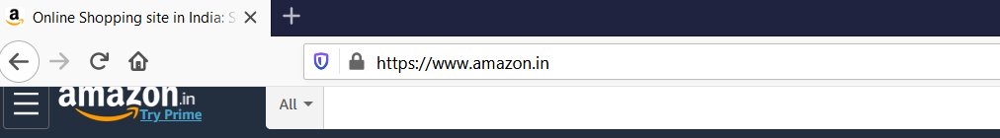
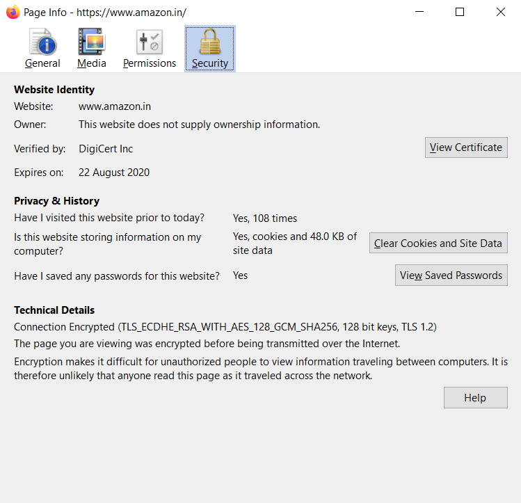
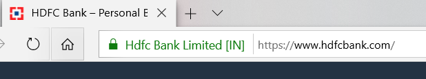

## SSL Certificates

- When a user accesses a website, **data is transferred** between the **`client`** (browser) and the **`server`** (website). 
- This **data is not safe to send** in the clear because <ins>**it may be read by an attacker**</ins> (it means it’s transmitted without any form of encryption, making it easily readable by anyone who intercepts it). 
- This poses **a significant risk, <ins>especially for sensitive information like credit card details**</ins> or passwords, as attackers could intercept and misuse this data.

```js
- SSL(Secure Sockets Layer) Certificates create an encrypted environment between a client and server.
- SSL is nothing but a small data file installed on a Web Server that allows for a secure connection
between the server and browser.
```

The certificate is **`base64`** encoded and contains the following information:

- **Name of the `entity`** to which certificate was issued.
- The **public key required for `encryption`** and digital signature verification.
- The **digital signature created with the `private key`** of the certificate issuer.

```js
- SSL is the protocol that is used to secure the HTTP.
- SSL is deprecated now and Transport Layer Security (TLS) is used instead.
- Most SSL certificates today, also supports the TLS protocol, which is considered to be more secure than SSL.
```

#### The <ins>application owner should install the SSL certificate on its web server</ins>. 

#### When an application is secured by an SSL certificate <ins>then its URL starts with `https` instead of `http`.</ins>

---

In the below screenshot you might have noticed a lock symbol before the URL. This symbol tells that this website is secured by a certificate.



- We can **`click`** on the lock symbol to get more details about the certificate as shown in the image below. 
- We can see the certificate **and also see which <ins>Certification Authority (CA) issued</ins> this certificate**.


```js
- A Certification Authority (CA) is an organization which is trusted to sign, issue and revoke digital certificates.
- Some of the most popular certification authorities are Sectigo SSL, Symantec SSL, RapidSSL, GeoTrust SSL, Thawte SSL
```



----

##  SSL certificates validation level:

- Before a <ins>**Certification Authority (CA)**</ins> issues an SSL certificate to an organization, **they have to `validate` the organization**.
- The **<ins>CA needs to validate</ins> that the organization is doing `legal` business and `owns` the domain**. This is what’s known as SSL certificate validation.

### There are three main types of `validations`:

#### 1. Domain Validation Certificates:
- Is the most **`basic`** type of SSL certificate,
- Can be obtained in **few `minutes`** and it is **`not`** very expensive.
- Suitable for websites that need encryption **and nothing more**.

```js
- To obtain this certificate, an applicant needs to prove that their control over the domain name only.
- The issued certificate contains the domain name that was supplied to the certification authority within the certificate request.
```

#### 2. Organization Validation Certificates:
- Applicant needs to <ins>**prove that their company is registered and legally accountable business**</ins>.
- Getting this certificate **takes 3-4 days**.
- Suitable for sites that **need the user to `authenticate`**.

```js
- This level of certificate provides a way for the customers to check the verified business information in the certificate details section.
- This is not available in Domain Validation Certificates.
```

#### 3. Extended Validation Certificates:

- **Very expensive** and takes some time to obtain, as a lot of “Vetting” is done before issuing.
- **"Vetting"** refers to the process of conducting a thorough background check or investigation.
```js
- Suitable for applications that ask for confidential details of users like credit card numbers.
- This certificate can be easily distinguished from the other two certificates, as the URLs of websites with this certificate 
have a green address bar containing the company name.
```



- #### Modern browsers like `Chrome`, `Firefox`, and `Safari` <ins>no longer display a green address bar</ins> for Extended Validation (EV) SSL certificates. 
- #### This feature was removed around 2019 across these browsers to avoid confusion between the certificates.

-----

## Types of SSL Certificates

- The SSL certificates can be divided into **three types** based on the number of domains it **`protects`**.

### 1. Single-name SSL certificates:
- Only be used for single domain or IP.
- Not applicable on sub-domains.

```js
- For example, if www.mysite.com has a certificate then it is not applicable to blog.mysite.com.
- This is the default SSL certificate type and it is available at all validation levels.
```

### 2. Wild Card SSL certificates:

- A wildcard SSL certificate is applicable to a domain and all its subdomains. 

```js
- For example, if *.mysite.com has a wildcard certificate then this certificate will be applicable on all its sub-domains 
like contact.mysite.com or mail.mysite.com will also have the certificate.
```


### 3. Multi Domain SSL certificates:
- A multi-domain SSL certificate lists multiple distinct domains on one certificate. With an MDC, domains that are not subdomains of each other can share a certificate. 
```js
- For example, domains like www.mysite.com, www.example.com, and www.abc.com can share the same certificate.
```