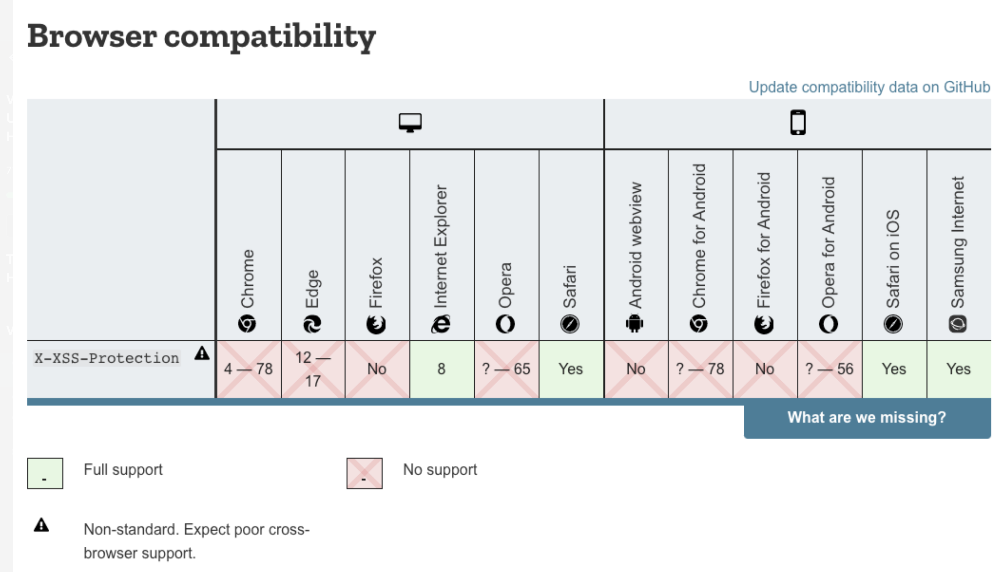

### X XSS Protection

- **_Enables_** a browser’s **_built-in Cross-Site Scripting (XSS) protection_**, which helps mitigate XSS attacks.
- Browser specific Cross-Site Scripting protection.
- Used by IE8 and IE9 and allows the XSS filter capabaility that is built into the browser to be toggled on or off.
- Not in active use anymore
- This Security header is simply a server response and it is still effective to employ.

- Turning XSS filtering on for any IE8 and IE9 browsers rendering your web application <strong>requires the following HTTP header</strong>

```js
// Configured via an HTTP header to enable or disable the browser’s XSS protection.
X-XSS-Protection: 1; mode-block
```

##### With helmet, this protection can be turned on using the following snippet.

```js
const helmet = require('helmet');
app.use(helmet.xssFilter());
```

---

- **X-XSS-Protection** header is considered **`deprecated`** and should mandate that you establish and roll out a Content Security Policy HTTP header instead.
<br/>

- It's still useful to keep as a header if you are targeting older browsers, 
  - but otherwise note that **`Chrome`** and **`Edge`** removed their XSS auditor
  -  Firefox isn't planning on implementing support for X-XSS-Protection.

