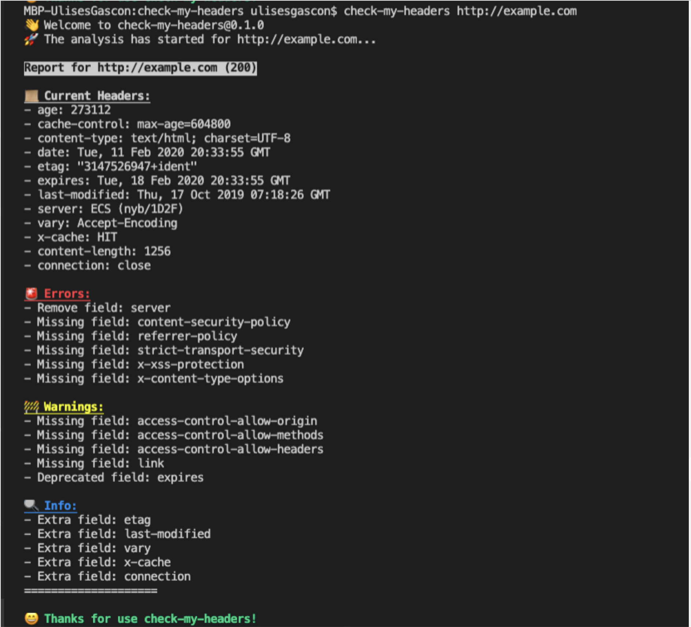

#### Check my headers is a fast and simple command line application in Node.js <ins>to ping web servers</ins> and <ins>inspect the Http Security Headers</ins> to provide a status log.

#### This has to be installed in your development environment (or in your continuous integration pipeline)

#### If you have a javascript tooling setup environment setup then it can be easily installed.

#### In a modern Node.js environment, we can make use of npx tool to execute a one-off executable npm package

```js
// To start a scan, we can run the following command:
npx check-my-headers https://example.com 
```
#### This will yield a result similar to the following screenshot:


----

#### check-my-headers can also be used programmatically. As it is an npm package, it can be used as a library

```js
// The below will test the web page for HTTP headers and return a promise, 
// upon which it will print the result data of the scan to the console.
const checkMyHeaders = require('check-my-headers')

checkMyHeaders('https://example.com').then(({messages, headers, status})=>{
    console.log(`Status code: ＄{status}`)
    console.log(`Messages:`)
    console.log(messages)
    console.log("Current headers:")
    console.log(headers)
})
```

---

#### Q) What are some ways you can make sure you have no regressions in your security headers setup ?

<details>

#### *Run tools like check-my-headers in the Continuous Integration systems to fail the build if a regression happens*

#### *In the end to end continuous integration setup, use the WebPageTest API to schedule tests of the website and ensure the security score is the same or better*

<summary>
View Answer
</summary>
</details>