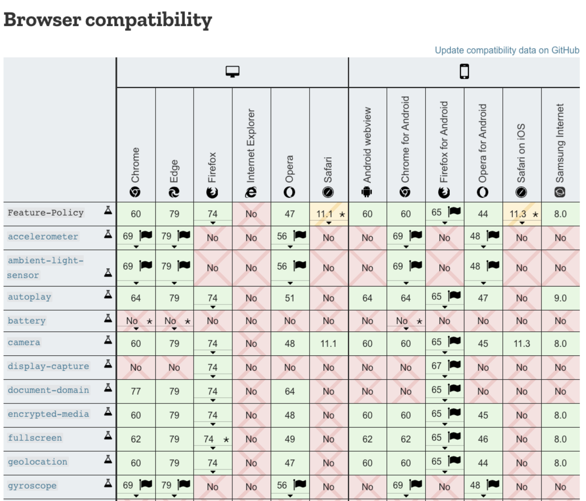

## Feature policy

- The Feature-Policy header is quite similar to the Content Security Policy, but instead of the content itself, 
  - it **targets the <ins>browser’s own trusted policy setting</ins> capabilities**.
<br/>

- For example, it allows you to **set a policy for a website to <ins>never request and enable camera access**</ins>.
  - Helps us to diminish the attack surface and create security controls **to protect the end-user**.

### Real-time Scenario:

- Attacker **can inject JavaScript code that requests browser permissions from the user** 
  - for camera, 
  - geolocation, 
  - or other browser capabilities. 
<br/>

- In a specific context, these may seem a legitimate request and unsuspecting users may be less hesitant to approve them. 
<br/>

- All of this **concludes with the malicious attacker gaining unwanted access** to capabilities impacting an end-user.

---

### Points to remember:

- A header such as **`Feature-Policy`** 
  - allows us to **instruct the browser** with a **`denylist`** or **`allowlist`**. 
<br/>

- This allows us to ensure that, 
  - even when an XSS vulnerability exists, 
  - it will **conflict with the browser’s trust policy** around features 
  - and **protect the user from such** malicious attempts.

----

```js
// An example used in an HTTP response:
Feature-Policy: camera 'none'; geolocation 'none'
```

---



---

- Helmet **doesn’t** yet support the **`Feature-Policy`** header. 
  - However, you may define it in a Node.js web application using one of the following ways:

1. Set that HTTP header as part of the web application framework. The following is an example of using Express to set it for all responses:

```js
app.use(function (req, res, next) {
  res.setHeader('Feature-Policy', "geolocation 'none'")
  return next();
});
```

2. Use the independent feature-policy on npm refers to the approach of incorporating the Feature Policy HTTP header into a Node.js web application by utilizing a separate, dedicated npm package named **`feature-policy`**
3. This package is designed to simplify the process of defining and enforcing a feature policy which controls which web platform features can be used by a page.
4. This method is presented as an alternative to manually setting the header within the web app framework (like express)


----

#### There is also a security header that increases user privacy is **`Clear-Site-Data`** 
- which aims at minimizing the scope of data at rest for a website.

